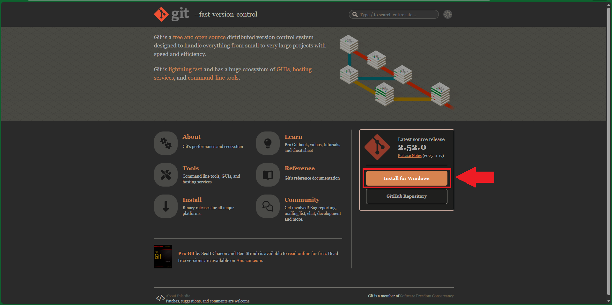

# Git

# Cách cài đặt Git

__Git__ là một phần mềm miễn phí và open source (mã nguồn mở) phục vụ cho việc quản lý source code.

Tải Git tại trang chủ của họ: https://git-scm.com/

Ấn vào __Download__ ở góc dưới bên phải của trang web. Tại đây, bạn sẽ thấy Git tự gợi ý bản cài phù hợp với hệ điều hành của bạn.



Hãy ấn vào nút __Download__ màu đỏ và cài đặt theo mặc định.

# Cách sử dụng Git

## 1. Câu lệnh đầu tiên

Clone code từ Github
```bash
git clone https://github.com/namnth2000/youtube-notes.git
```

## 2. Các câu lệnh sử dụng hàng ngày

### 2.1. Nếu bạn làm việc một mình

Clone code từ repository của dự án và tạo một branch mới cho tính năng bạn đang làm việc:

```bash
git checkout main
git pull
git log --oneline
git checkout -b feature_branch
```

Push code lên remote repository sau khi làm xong:
```bash
git add .
git commit -m "Fix all bugs"
git push origin feature_branch
```

### 2.2. Nếu bạn làm việc cùng nhiều người khác trên cùng một repository

Pull code mới nhất:
```bash
git pull --rebase origin main
```

Sau lệnh này, các commit ở local của bạn sẽ được đặt sau các commit được pull từ trên repository.

Nếu như bạn muốn lấy code về nhưng chưa muốn merge vào trong local repository, dùng lệnh này:
```bash
git fetch
```

## 3. Trong những ngày hoảng loạn (code bị conflict)

### 3.1. Reset
Trong quá trình làm việc, có thể bạn làm lỗi và cần revert code về một commit (phiên bản) nào đó, bạn có 3 lựa chọn khi sử dụng `git reset`

1. Reset code về phiên bản `commit_id`, giữ lại code của bạn ở trong stage để bạn có thể commit lại:
    ```bash
    git reset --soft commit_id
    ```

2. Reset code về phiên bản `commit_id`, giữ lại code của bạn ở trạng thái unstaged (cần dùng `git add` để chuyển nó vào stage trước khi commit):
    ```bash
    git reset --soft commit_id
    ```

3. Reset code về phiên bản `commit_id` và xóa mọi thay đổi:
    ```bash
    git reset --hard commit_id
    ```

### 3.1. Stash
Bạn có thể lưu tạm thời code vào trạng thái stash trước khi thực hiện các thao tác `git rebase` hoặc `git checkout` sang branch khác để tránh conflict.

Lưu các thay đổi hiện tại vào stash:
```bash
git stash
```

Bung code ra từ stash sau khi thực hiện các thao tác khác xong:
```bash
git stash pop
```

# Một số tip

- Update code vào commit mới nhất
    ```bash
    git add filename

    # Sau lệnh này code sẽ được update vào commit ở local
    git commit --amend

    # Nếu muốn đẩy phần đã update lên remote (ví dụ github)
    git push --force
    ```

- Push to ref (Gerrit):
    ```bash
    git push origin HEAD:refs/for/develop
    ```

- Clone chỉ 1 branch với 1 commit mới nhất:
    ```bash
    git clone -b my-branch --single-branch --depth 1 https://mycompany.gitlab.com/mygroup/myproject.git
    ```

- Sửa lỗi Permission denied (publickey) khi clone bằng ssh:
    ```bash
    vi ~/.ssh/config
    # Add these lines
    Host gerrit.mycompany.com
    User myusername
    ```

- Config username và email
    ```bash
    git config --global user.name "myusername"
    git config --global user.email "me@gmail.com"
    ```

